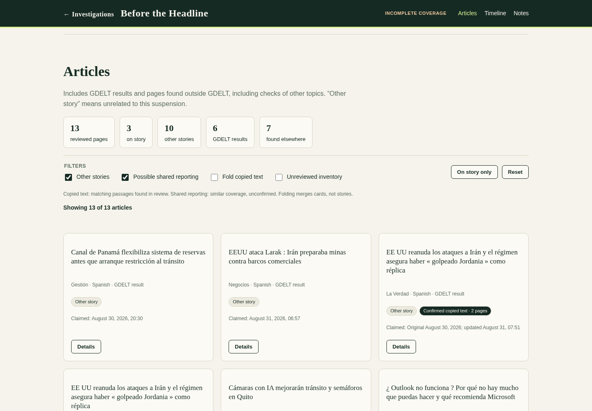
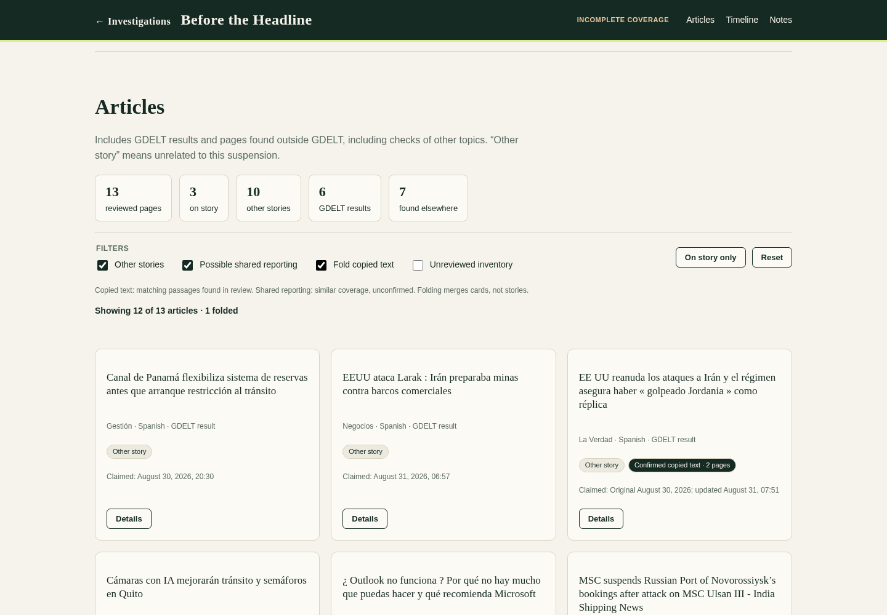
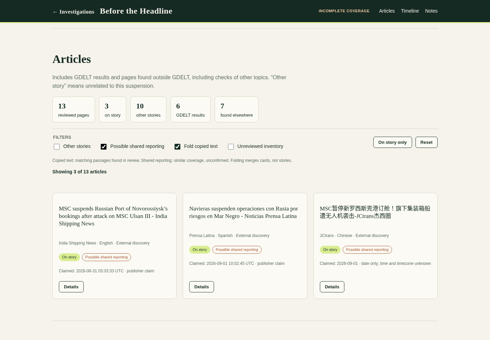
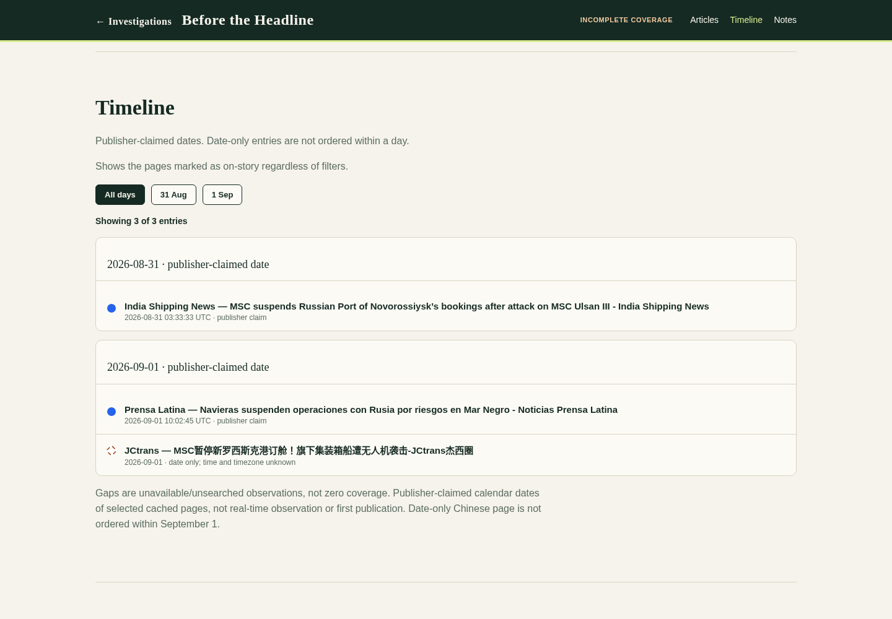
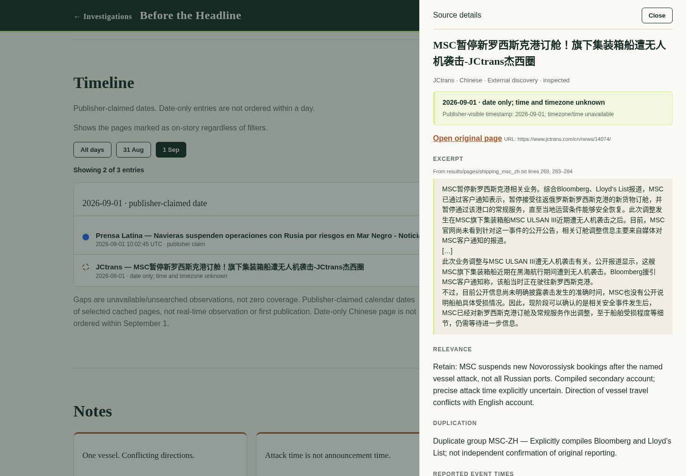
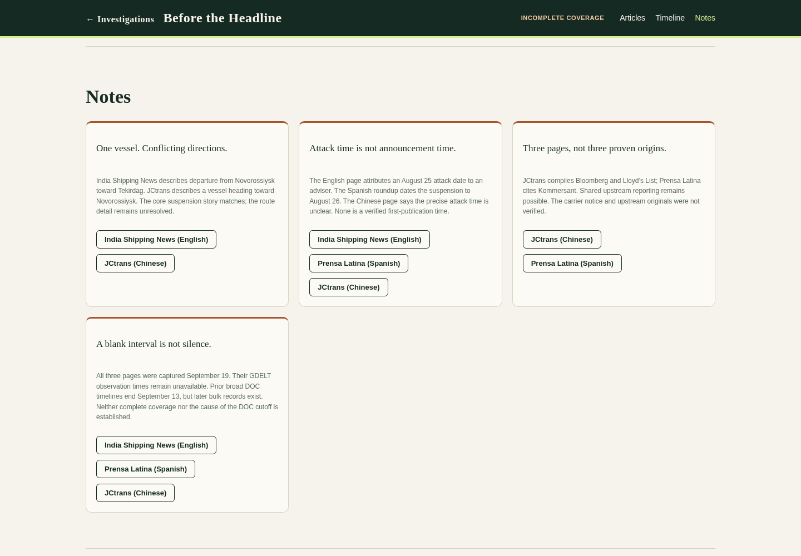
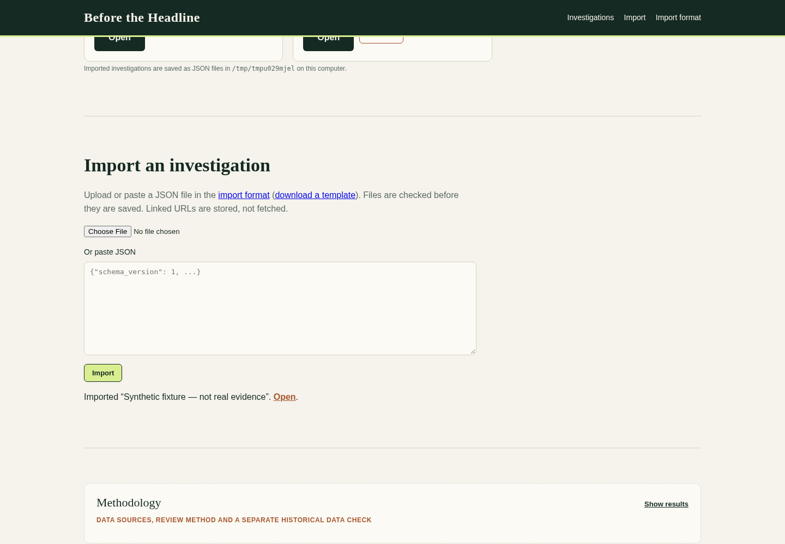

# Screenshots

Screenshots captured by test_judging.py from a fresh offline run.

## 00-home.png

Investigations home: bundled shipping case, filter box and JSON import panel.

## 01-workspace.png

Workspace hero: query context shows 694 aggregate matches kept separate from the reviewed pages.

## 02-articles.png

13 reviewed pages: 3 on story, 10 other; 6 GDELT-result pages and 7 found elsewhere.

## 03-fold-copied-text.png

One matching-text group contains two pages; folding merges one card.

## 04-on-story.png

On-story filter applied: three pages, each marked with possible shared-reporting uncertainty.

## 05-timeline.png

Publisher-claimed dates; the Chinese page is date-only.

## 06-source-details.png

Cached source excerpt, date-only precision, provenance and direction notes; no external link opened.

## 07-notes.png

Notes: route conflict, attack-time uncertainty, possible common upstream reporting and incomplete coverage.

## 08-import.png

Investigation imported via JSON paste: second card shows Imported badge; removal restores a clean list.

