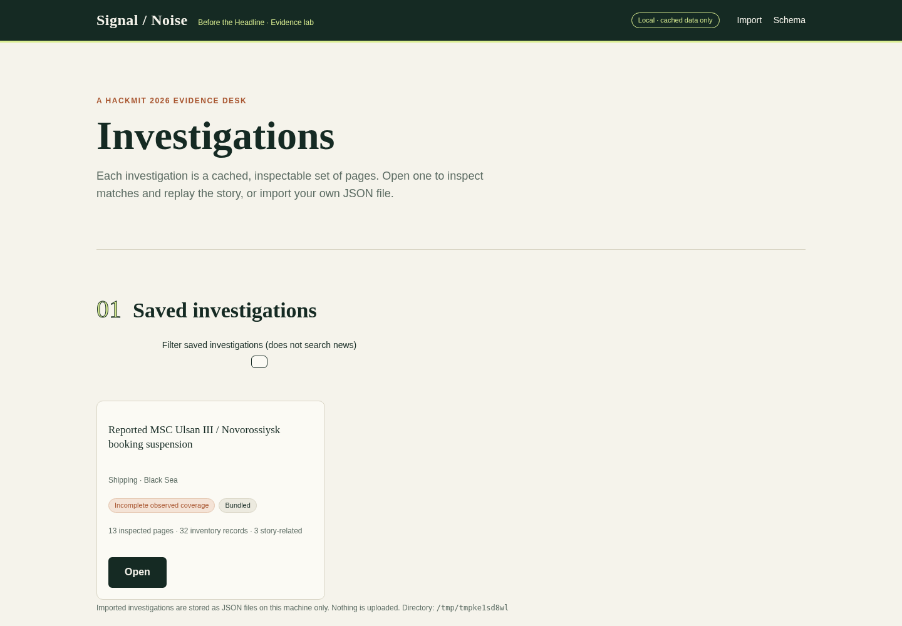
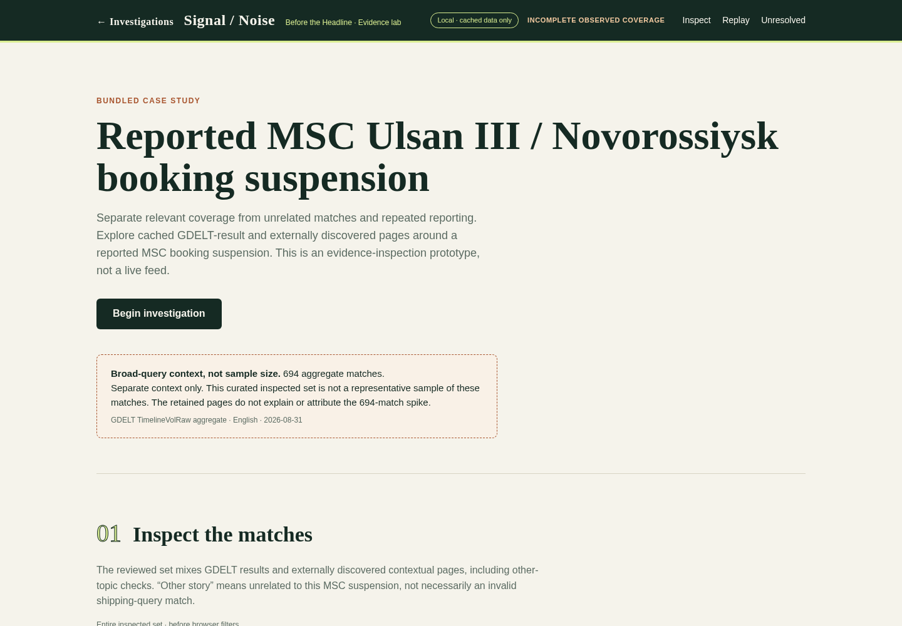
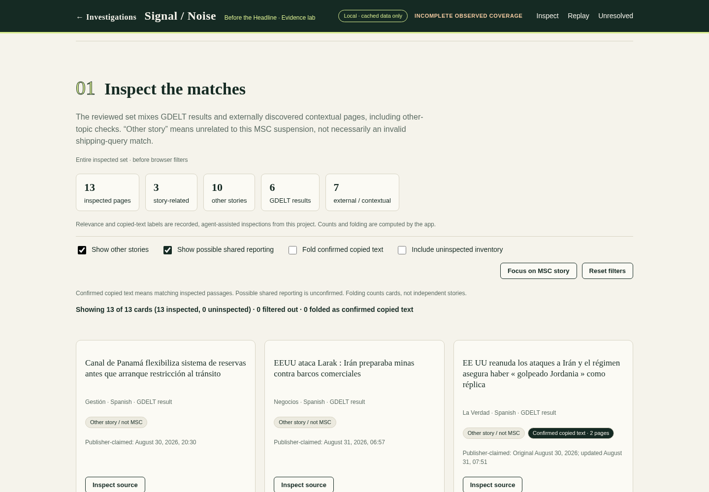
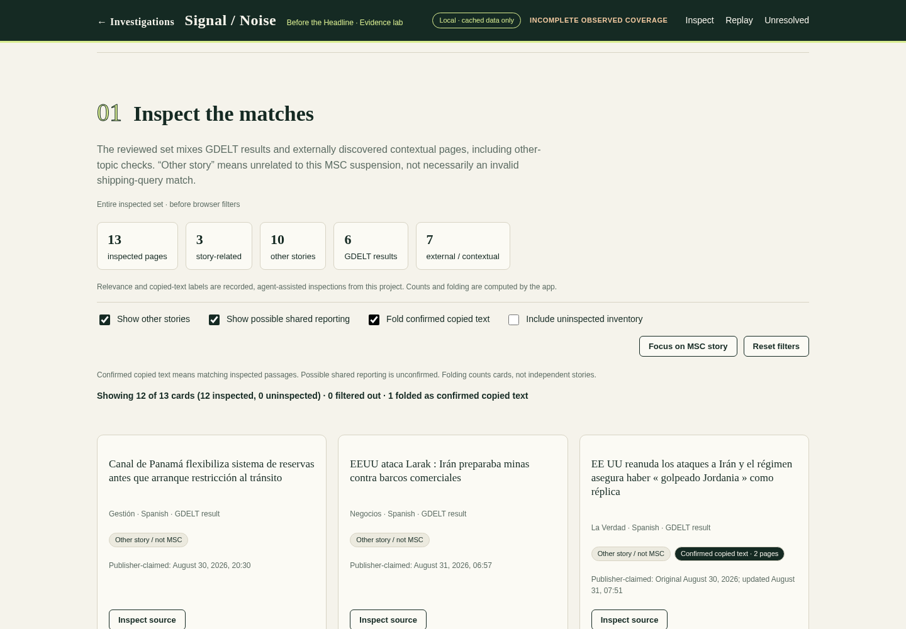
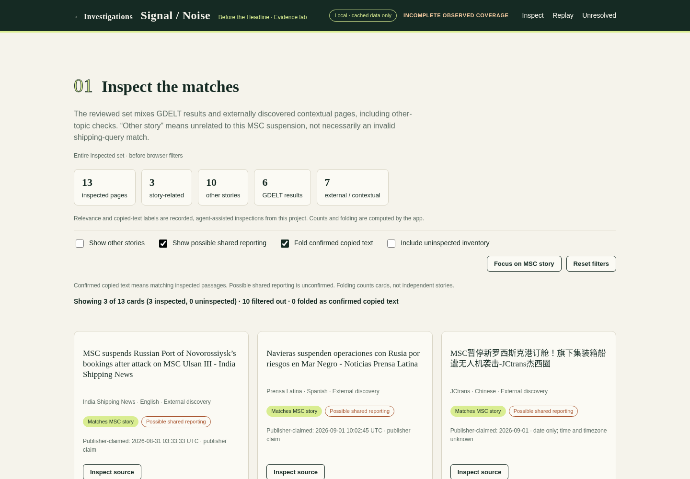
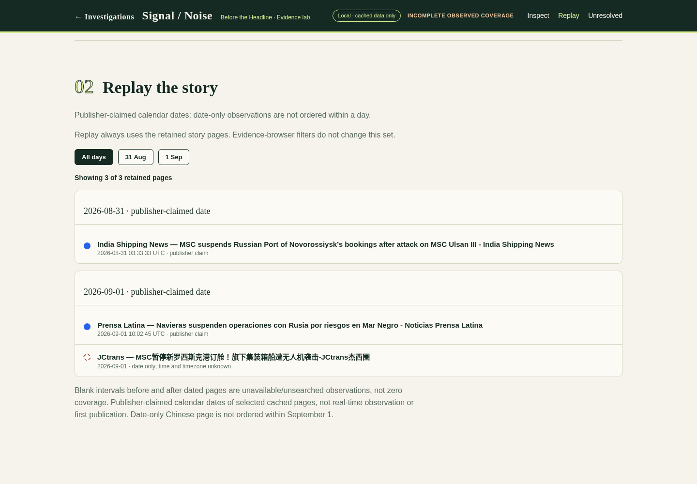
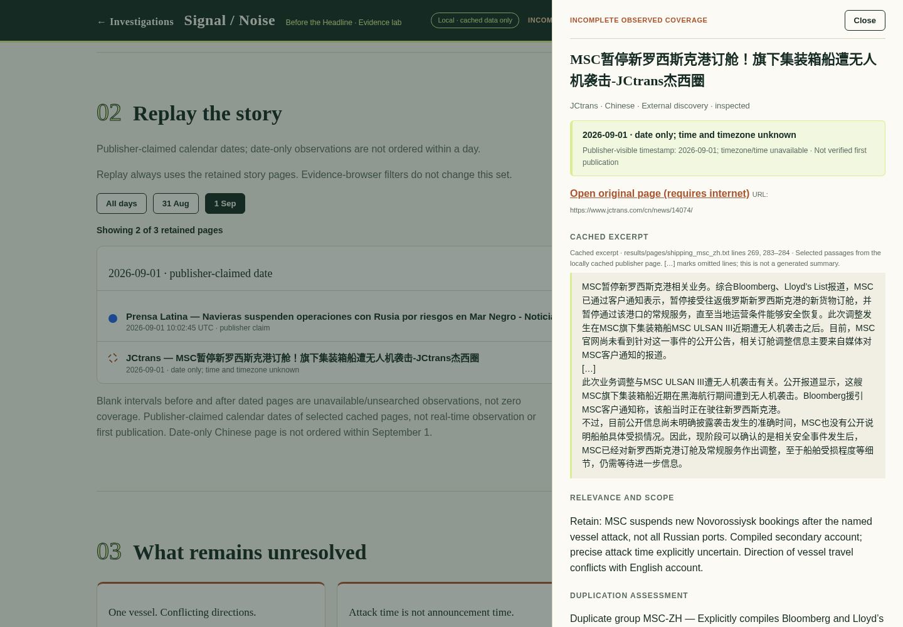
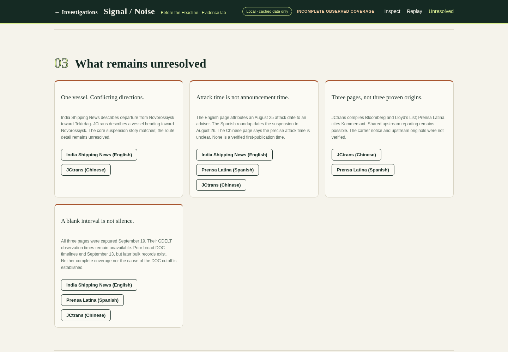
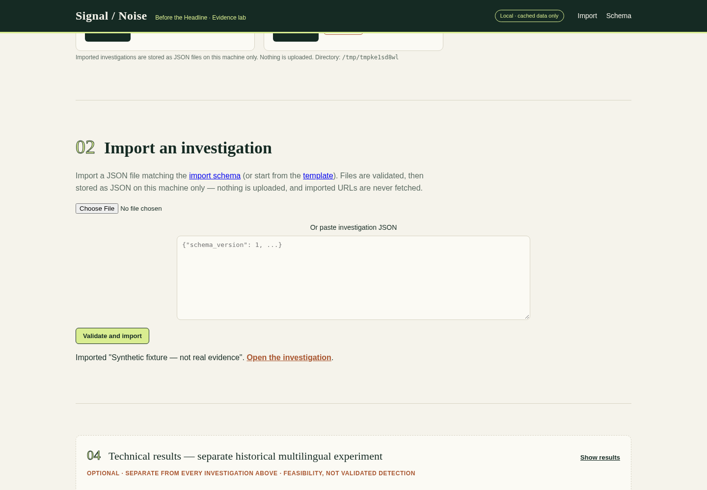

# Presentation fallback

These are actual screenshots from the fresh offline walkthrough, not synthetic examples. Follow in order while reading DEMO.md.

## 00-investigations-home.png

Investigations home: bundled shipping case, search box and JSON import panel.

## 01-opening.png

694 aggregate matches are separate context, not the inspected sample size.

## 02-inspected-sample.png

13 inspected pages: 3 MSC-related, 10 other; 6 Spanish GDELT-result pages and 7 external/contextual pages.

## 03-confirmed-copy-fold.png

One matching-text group contains two pages; folding removes one card, not an independent story.

## 04-related-pages.png

Three retained MSC pages remain; all retain possible shared-reporting uncertainty.

## 05-story-timeline.png

Publisher-claimed dates, not first publication; the Chinese page is date-only.

## 06-source-evidence.png

Cached source excerpt, date-only precision, provenance and unresolved direction details; no external link opened.

## 07-unresolved.png

Route conflict, attack-time uncertainty, possible common upstream reporting and incomplete coverage remain unresolved.

## 08-import-flow.png

Synthetic investigation imported via JSON paste: second card shows Imported badge; removal restores a clean list.

